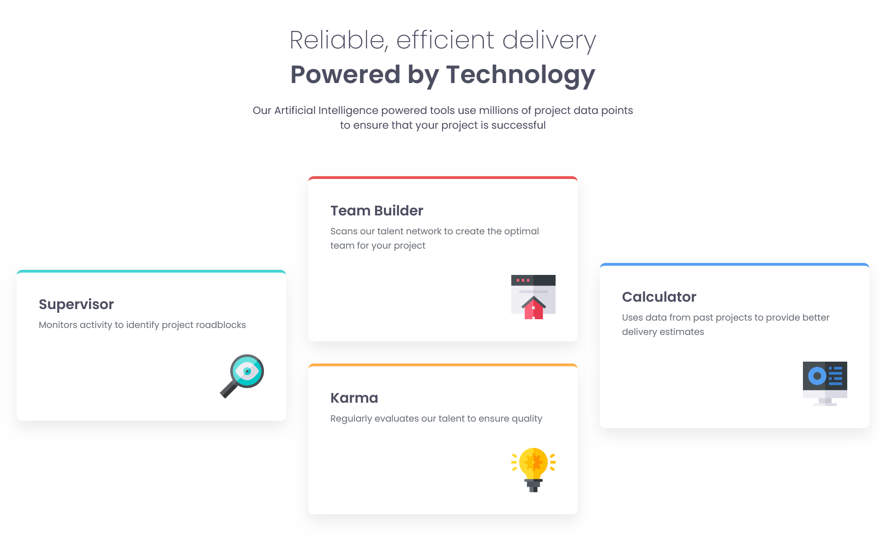

# Frontend Mentor - Four card feature section solution

This is a solution to the [Four card feature section challenge on Frontend Mentor](https://www.frontendmentor.io/challenges/four-card-feature-section-weK1eFYK). Frontend Mentor challenges help you improve your coding skills by building realistic projects. 

## Table of contents

- [Overview](#overview)
  - [The challenge](#the-challenge)
  - [Screenshot](#screenshot)
  - [Links](#links)
- [My process](#my-process)
  - [Built with](#built-with)
  - [What I learned](#what-i-learned)
  - [Continued development](#continued-development)
  - [Useful resources](#useful-resources)

## Overview

### The challenge

Users should be able to:

- View the optimal layout for the site depending on their device's screen size

### Screenshot

### Links

- Solution URL: [Add solution URL here](https://github.com/vishpant76/four-card-feature-section)
- Live Site URL: [Add live site URL here](https://vishpant76.github.io/four-card-feature-section/)

## My process

### Built with

- Semantic HTML5 markup
- Flexbox
- CSS Grid
- Mobile-first workflow

### What I learned

- Learned how to apply CSS grid and flexbox to build layouts that smoothly adapt to various screen sizes.

- Learned how to use media queries while following the mobile-first workflow.

### Continued development

- Would like to focus more on using css grid, grid-template-areas, etc. as they are very convenient to build complex layouts.

- Need more practice with media queries, identifying appropriate breakpoints, and adapting the layout to different screen sizes without messing up the HTML structure.
